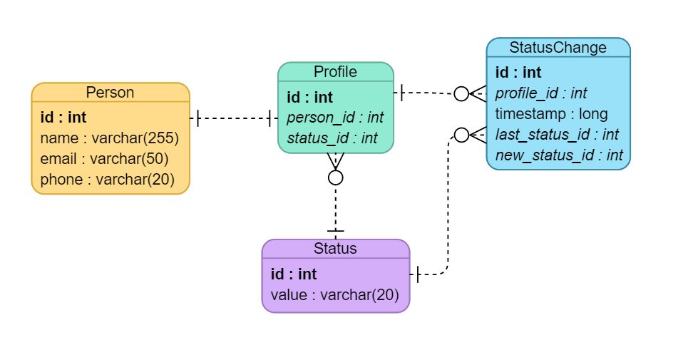
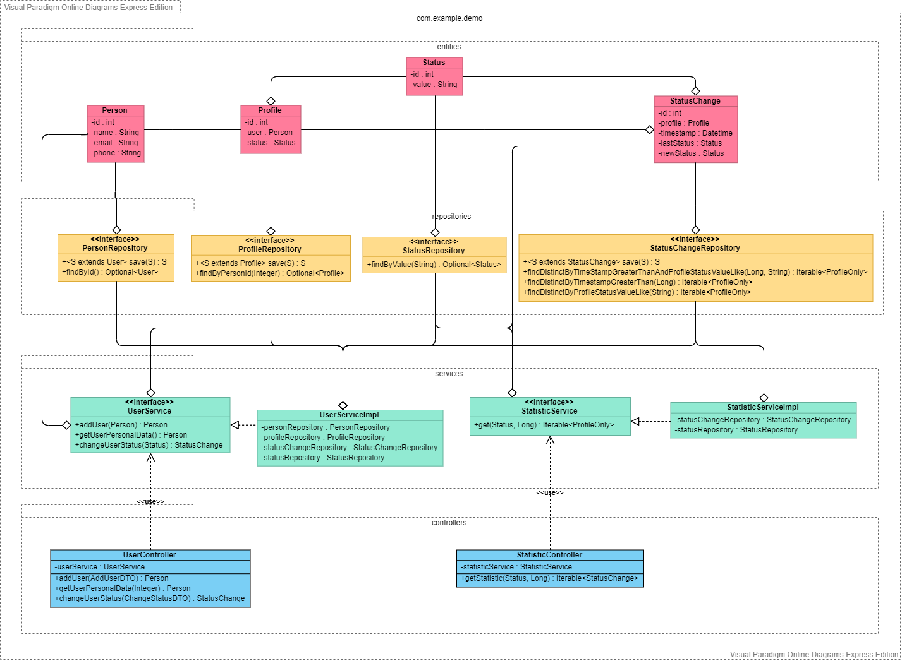

# json-http-api

RestAPI сервис с возможностью сохранения персональных данных пользователя, получения персональных данных по
id пользователя, а также для изменения статуса пользователя (Online/Offline) и получения статистики сервера
об изменениях статусов пользователей после определенного промежутка времени.

## Диаграмма сущностей базы данных

При использовании сервиса в базе данных должны быть заранее сохранены все возможные статусы пользователей.

## Диаграмма классов

Архитектура системы соответствует принципам clean architecture.

## Документация API

Документация доступна по ссылке /swagger-ui.html.
